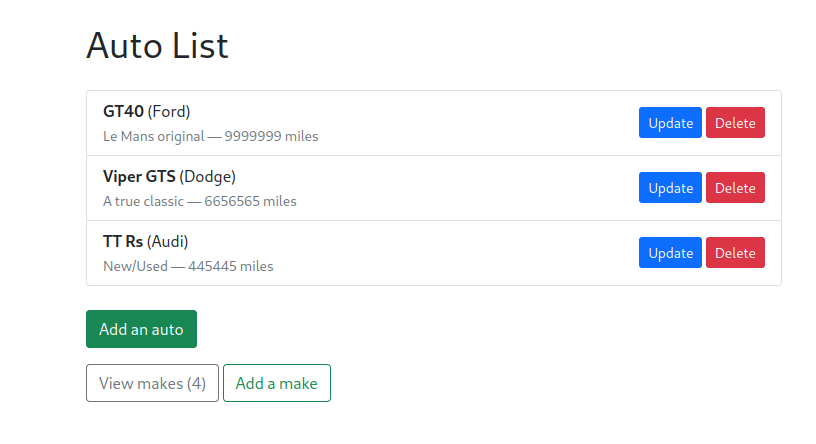

# Django Autos CRUD 🚗

[](https://www.python.org/downloads/release/python-3137/)
[](https://docs.djangoproject.com/en/5.2/)
[](LICENSE)

Fully working* CRUD (Create, Read, Update, and Delete) application to manage automobiles and their makes (i.e. Ford, Hyundai, Toyota, Tata, Audi, etc.).

This project is built with **Django 5.2** as a demo app to showcase Django fundamentals:  
- Models & migrations  
- Admin integration  
- Views & templates  
- URL routing  
- Forms & validation  

---

## 🔧 Local Setup

### Clone the repo
```bash
git clone https://github.com/Alexandurs/Django-CRUD-demo.git
cd Django-CRUD-demo
```

### Create & activate a virtual environment (Ubuntu)
```bash
sudo apt update && sudo apt install -y python3-venv
python3 -m venv venv
source venv/bin/activate
python -m pip install --upgrade pip setuptools wheel
```

### Create & activate a virtual environment (Kali)
```bash
sudo apt update && sudo apt install -y python3-virtualenv curl
virtualenv -p python3 venv
source venv/bin/activate
curl -sS https://bootstrap.pypa.io/get-pip.py -o get-pip.py
python get-pip.py
python -m pip install --upgrade pip setuptools wheel
```

### Install dependencies
```bash
pip install -r requirements.txt
```

### Set up the database models
```bash
cd django_autos_CRUD/
python manage.py makemigrations
python manage.py migrate
```

### Create a superuser to login
```bash
python manage.py createsuperuser
```

### Start the dev server
```bash
python manage.py runserver
```


---

## 🚀 Features
- Create, view, update, and delete automobile makes and models  
- Django admin enabled for quick data management  
- SQLite database

## Screenshot



### Project structure note
If you see **two directories named `django_autos_CRUD/`**, that’s normal in Django:

- The **outer `django_autos_CRUD/`** is the **project root** — it contains `manage.py` and Django apps (e.g., `autos/`).
- The **inner `django_autos_CRUD/`** is the **project package** — it contains `settings.py`, `urls.py`, `asgi.py`, and `wsgi.py` (imported as `django_autos_CRUD.settings`).

This duplication is created by `django-admin startproject` and is standard Django practice.

